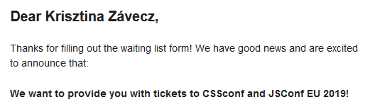

In this post, I’d like to tell you about why I chose to contribute to JSConf Budapest as a volunteer, and more importantly, about some of the things I learned and received.  To convey my message better, I felt I also needed to tell a little about how I got into volunteering - so grab some popcorn and bear with me!

__How I got into volunteering__

One day in 2018 (I was a “really junior” developer back then), I bumped into an opportunity to apply for a scholarship to JSConf EU 2019, which, at that time, was held yearly in Berlin. What could go wrong?! - I thought and quickly sent my application explaining why I wanted to participate. Weeks were passing by as I was impatiently waiting for the answer.

Seemingly unrelated, but at the end of March 2019, I was unexpectedly laid off from my (very first “real” front end developer) job, exactly at the one-year mark of me being there and despite the great reviews I got from my mentor / manager during that whole time.
I knew I wouldn’t give up, still I was deeply saddened. This really threw me off.

Also, a few days later I sadly got a rejection for my scholarship application from the JSConf EU team stating that I still made it to the waiting list.

OK… deep sigh.

My weeks in April 2019 mostly consisted of attending job interviews, talking to recruiters. One of them (Csudi, you are a gem and a blessing to this industry! <3 ) connected me to Szabolcs, lead organizer of JSConf EU’s “sibling event”, JSConf Budapest, who was at that time looking for volunteers for their event to be held in September. We set up a call, I provided my contact details and agreed that I’ll help them as a volunteer.

Fast forward some days, things started to clear up: I had two job offers to choose from, and started at one of them on the 6th of May. Two days later, in the afternoon, I still remember standing at the kitchen counter doing some household chore, when my phone beeped:

{ class="bordered-img" }

Wow, an almost last-minute scolarship to JSConf EU! :D :D I’ll be flying to Berlin, wooohoo! Needless to say, I was over the moon. Onboarding at the new job in the morning, getting a scolarship in the afternoon, could I have asked for more career-wise at that time? I literally wanted to hug the universe for being so kind to me!

On 29 May 2019, I boarded the plane. The next day I felt welcome, I learned, got new ideas, kept switching between watching talks and sightseeing… (and also got that little bug inside me: what if one day I could also stand on the stage giving a talk? But that is a topic for another day…). Long story short: I felt immensely grateful.

__My Why & the Takeaways__

_(oh my god, this section title sounds like a rock band name! Join us on tonight’s show with ‘My Why and The Takeaways’, LOL)._

So, I got "infected" with the JSConf-vibe in Berlin and volunteered in Budapest, in 2019 September. All my feelings of gratitude lead me to the decision of wishing to participate next time, too. The pandemic came, and the event had to be cancelled twice, until June 2022. It was a no-brainer that I’d like to be a volunteer this time again if possible.

Initially, my reason (the “why”) to volunteer at JSConf Budapest was to make connections and to learn. But I got so much more already at the 2019 event. All my positive feelings just got reinforced this second time I volunteered a few days ago.

* great vibes
* a sense of belonging
* the possibility to contribute to the work of a very welcoming, low-hierarchy team (one with a “we can solve everything together” mindset. Few people hate bullshit more than I do, so you can take my word for granted. :) )
* learning from each other, either by watching some talks in my free time or just by connecting to speakers, participants or to my peer volunteers. Sharing our experience regardless of gender, skin colour, ethnicity, etc.
* got momentum to discover tech concepts I’ve just superficially touched
* getting to know some twitter pals IRL
* great selection of talks: a meaningful number of them were about mental health and / or communication (dev-to-user, dev-to-dev, dev-to-business). Huge kudos to the CFP reviewer team to include these types of talks: this is rare and brave in the tech scene as far as I’ve seen. These talks are also really relatable: “wow, this has also happened at my job! oh, I’m also guilty of [not-so-good-practice-in-communication]!”
* quality of the talks: I loved how many of them showed already familiar concepts connected in fresh and unique ways, shedding light on new chain links between them. Give the LEGO-set to me, I’ll build a fast spaceship. Give the LEGO-set to them, they’ll build a beautiful castle!
* get a little insight into being a speaker: yes, even seasoned speakers are nervous before their talks, yes, they appreciate our work, and yes, they are lovely persons to connect to!

Besides the above, I’m also taking home some experience at a more personal level, like:

* realising that while I’m kind of okay-ish at spoken English, I still have room for improvement
* the lovely experience of meeting CodeBerry founders - they were also volunteering! :)  (CodeBerry is the school where I (re-)started to learn to code years ago)
* ...and how a single helpful sentence can boost your self-confidence about giving a talk one day. (Tejas, if you are reading this: I’m sending you a huge ‘thank you!!’)
